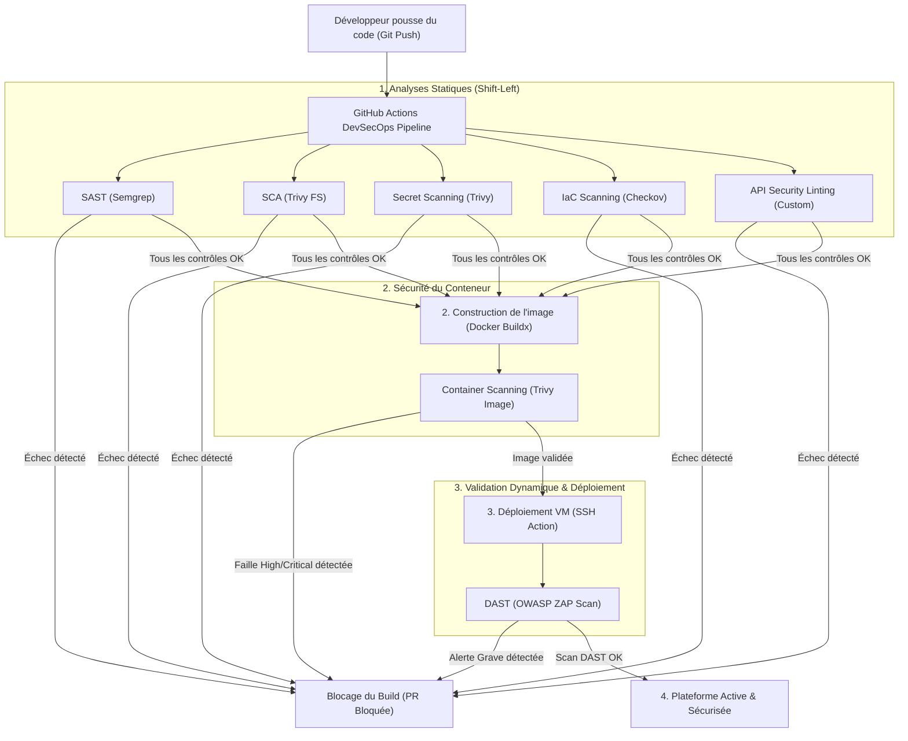

# CHAPITRE 4 : IMPLÉMENTATION PRATIQUE ET VALIDATION DE L'ARCHITECTURE SÉCURISÉE

Ce chapitre détaille la réalisation technique, le déploiement et la validation de l'architecture de sécurité conçue pour l'écosystème de bancassurance de **NSIA Assurance** en République du Congo. Dans le respect de la démarche *Security by Design*, chaque décision de conception et chaque ligne de configuration ont été pensées pour s'aligner sur les exigences de la **Loi n° 26-2019 sur la cybersécurité** et de la **Loi n° 29-2019 sur la protection des données à caractère personnel**. 

L'implémentation pratique repose sur un socle conteneurisé et orchestré, appliquant le principe de défense en profondeur. Ce chapitre présente l'infrastructure, la gestion des identités, le profilage des API, le chiffrement des données, la supervision par le SIEM, et enfin, les résultats des tests d'intrusion simulant des attaques réelles pour prouver la résistance du système.

---

## 4.1 VUE D'ENSEMBLE DE L'ARCHITECTURE IMPLÉMENTÉE

L'architecture technique cible s'articule autour de la notion de **Security Fabric** : un maillage cohérent où les composants de transport, d'identification, de logique métier et de supervision collaborent de manière dynamique. 

### 4.1.1 Cartographie de l'infrastructure
L'infrastructure a été déployée sur un cluster Kubernetes, segmenté en cinq plans logiques distincts (*Namespaces*) pour garantir un cloisonnement strict au niveau réseau et administratif.

La **Figure 4.1** schématise la topologie logique des composants et le cheminement des flux de données à travers l'infrastructure :

```text
Internet
    │
    ▼
ModSecurity WAF (Sidecar de Kong, inspection OWASP CRS v4)
    │
    ▼
Kong API Gateway (Routage déclaratif GitOps via decK, Rate-Limiting, validation JWT)
    │
 ┌──┴───────────────┐
 │ (Flux d'identité)│ (Flux applicatif / jeton JWT)
 ▼                  ▼
Keycloak IdP     Django API Backend (Vérification FGAC, interception BOLA)
 │                  │
 ▼                  ▼
PostgreSQL DB    PostgreSQL DB (Enforcement de la Row Level Security - RLS)
      │
      └─────────────┬─────────────┘
                    │
                    ▼ Ingestion des logs (DaemonSet Agent) / Analyse passive
              Wazuh SIEM + Suricata IDS (Détection réseau et alertes SOC)
                    ▲
                    │ Certification cryptographique & Injection de secrets
              HashiCorp Vault
```
<center>**Figure 4.1 : Topologie et flux de la Security Fabric NSIA sur Kubernetes**</center>

Chaque flux externe ou inter-services est soumis au principe du moindre privilège. La passerelle **Kong Gateway**, associée au pare-feu applicatif **ModSecurity**, constitue l'unique point d'entrée réseau exposé aux partenaires.

### 4.1.2 Matrice de correspondance Risques / Contrôles
Pour démontrer l'adéquation de l'implémentation avec les menaces théoriques identifiées dans les phases d'analyse de risques, le **Tableau 4.1** associe chaque vulnérabilité majeure à son mécanisme de contrôle technique opérationnel :

#### Tableau 4.1 : Correspondance entre risques (Chapitre 3) et mécanismes implémentés (Chapitre 4)

| Risque Identifié (Chapitre 3) | Vecteur d'Attaque Direct | Mécanisme de Défense Implémenté (Chapitre 4) | Composant Technologique |
| :--- | :--- | :--- | :--- |
| **Interception de données (MITM)** | Écoute réseau, injection de trafic | Transport chiffré TLS 1.3 et authentification mutuelle client (**mTLS**) | Certificats PKI Kong & Vault |
| **Usurpation d'identité (BOLA)** | Modification d'ID de banque dans les URLs | Validation stricte du claim `bank_id` du token JWT au niveau de la DB et de l'ORM | Middleware Django & PostgreSQL Row Level Security (RLS) |
| **Force Brute & Bourrage** | Credential Stuffing sur portail agent | Verrouillage dynamique des comptes, délais d'attente et authentification multifacteur | Keycloak IAM & MFA (TOTP) |
| **Déni de Service (DoS/DDoS)** | Inondation de requêtes API | Limitation dynamique et configurable du nombre de requêtes par consommateur | Kong Rate-Limiting Plugin |
| **Injections applicatives (SQLi/XSS)** | Requêtes HTTP avec payloads malveillants | Inspection HTTP, blocage et injection de filtres ORM | ModSecurity WAF (OWASP CRS v4) & Django ORM |
| **Reconnaissance active** | Scan de ports agressif (Nmap...) | Détection de signatures de balayages réseau internes et externes | Suricata IDS |
| **Fuite de données sensibles (PII)** | Accès physique BDD ou dump mémoire | Chiffrement transparent au repos (champs) et blind indexes pour recherche exacte | AES-256-GCM (Python Cryptography) & HashiCorp Vault |
| **Menace interne / Privilèges** | Vol de session admin de banque | Cloisonnement strict des rôles d'administration et corrélation des accès | Keycloak FGAP V2 & Agents Wazuh DaemonSet |

---

## 4.2 MISE EN ŒUVRE DE L'INFRASTRUCTURE SÉCURISÉE

Le déploiement de l'architecture s'appuie sur une chaîne DevSecOps moderne intégrant la conteneurisation, l'orchestration Kubernetes légère et l'automatisation de l'infrastructure comme du code (IaC).

### 4.2.1 Conteneurisation des services avec Docker
Pour garantir l'herméticité des environnements d'exécution, chaque composant de l'architecture a été encapsulé dans une image Docker. Les images de base ont été sélectionnées pour leur faible surface d'attaque (distributions basées sur *Alpine Linux* ou images officielles minimales endurcies) :
* Le backend Django utilise une image `python:3.11-slim` dépourvue de paquets de compilation inutiles en production.
* L'API Gateway utilise `kong:3.6` (version certifiée sans base de données locale pour la conformité GitOps).
* Le WAF s'appuie sur `owasp/modsecurity-crs:nginx-alpine` optimisé pour bloquer les attaques périmétriques.

### 4.2.2 Orchestration par K3s
L'orchestration des conteneurs est assurée par **K3s**, une distribution certifiée par la *Cloud Native Computing Foundation (CNCF)*, hautement sécurisée par défaut et optimisée pour consommer moins de ressources.
Le partitionnement de l'infrastructure est réalisé via la création de cinq **Namespaces** Kubernetes étanches :
1. `nsia-ingress` : Expose le proxy Nginx/ModSecurity et la Gateway Kong (Data Plane / Entrée).
2. `nsia-frontend` : Héberge l'application cliente Web Next.js (Presentation Plane).
3. `nsia-iam` : Héberge le serveur Keycloak et sa base de données PostgreSQL dédiée (Identity Plane).
4. `nsia-backend` : Contient l'API métier Django et sa base de données PostgreSQL dédiée (Business Plane / Core).
5. `nsia-security` : Centralise les outils de supervision (Wazuh SIEM, Suricata IDS) et le coffre-fort HashiCorp Vault (Supervision Plane).

### 4.2.3 Automatisation par Ansible
Le déploiement et la configuration de l'infrastructure de gestion des identités (IAM Keycloak) ont été industrialisés à l'aide d'Ansible, éliminant ainsi les configurations manuelles sujettes aux erreurs humaines. 

Le rôle Ansible `nsia_iam_central_enforcer` offre trois modes d'exécution :
* **Mode Global (all)** : Déploiement identique et idempotent des politiques de sécurité sur l'ensemble des realms du registre centralisé (12 banques partenaires).
* **Mode Ciblé (single)** : Provisionnement ou mise à jour isolée d'un seul partenaire (ex. `target_bank_name=ecobank`).
* **Mode Interactif (interactive)** : Assistant en ligne de commande permettant de saisir le nom du nouveau partenaire, de ses agences et de configurer dynamiquement les accès.

### 4.2.4 Segmentation réseau et NetworkPolicies
Pour empêcher un conteneur compromis de scanner ou d'attaquer les autres composants du cluster, des règles de filtrage réseau internes (**NetworkPolicies**) ont été déployées au niveau de K3s. Par défaut, la politique globale applique un modèle **Deny-All** (aucun trafic réseau n'est autorisé entre les namespaces sauf s'il est explicitement déclaré).

Le listing ci-dessous présente le fichier `netpol-backend.yaml` régissant le Namespace de la logique métier :

```yaml
apiVersion: networking.k8s.io/v1
kind: NetworkPolicy
metadata:
  name: allow-backend-traffic
  namespace: nsia-backend
spec:
  podSelector: {}
  policyTypes:
    - Ingress
    - Egress
  ingress:
    # Trafic entrant limité uniquement depuis la Gateway Kong (Namespace nsia-ingress)
    - from:
        - namespaceSelector:
            matchLabels:
              nsia.cg/purpose: ingress
      ports:
        - port: 8000
    # Trafic interne : Base de données accessible uniquement par le pod backend Django
    - from:
        - podSelector:
            matchLabels:
              app: backend
      ports:
        - port: 5432
  egress:
    # Trafic sortant autorisé vers sa propre base PostgreSQL interne
    - to:
        - podSelector:
            matchLabels:
              app: backend-db
      ports:
        - port: 5432
    # Trafic sortant vers Keycloak pour la validation des jetons
    - to:
        - namespaceSelector:
            matchLabels:
              nsia.cg/purpose: iam
      ports:
        - port: 8080
    # Trafic sortant vers Vault pour la récupération dynamique des clés
    - to:
        - namespaceSelector:
            matchLabels:
              nsia.cg/purpose: soc
      ports:
        - port: 8200
    # Résolution DNS interne (CoreDNS)
    - to: []
      ports:
        - port: 53
          protocol: UDP
```

Cette NetworkPolicy garantit que le serveur PostgreSQL du backend Django ne peut jamais communiquer avec l'extérieur ou avec le plan IAM, limitant drastiquement les risques de mouvement latéral et d'exfiltration de base de données.

---

## 4.3 IMPLÉMENTATION DU SYSTEME DE GESTION DES IDENTITES (IAM)

La centralisation de l'identité des utilisateurs (conseillers bancaires, administrateurs d'agences) constitue la pierre angulaire du contrôle d'accès dans le projet. Elle s'appuie sur la solution open source **Keycloak v22+**.

### 4.3.1 Keycloak et architecture multi-tenant
L'architecture implémente le modèle **Multi-Tenant (multi-entité)**. Pour éviter que les agents d'une banque partenaire ne puissent découvrir ou interférer avec les utilisateurs d'une autre institution, un cloisonnement cryptographique et logique fort a été configuré :
* **Un Realm distinct par partenaire** : 12 realms indépendants ont été générés (ex. `BANK_ECOBANK`, `BANK_BGFI`, `BANK_CREDIT_DU_CONGO`, etc.).
* **Isolation cryptographique** : Chaque Realm dispose de ses propres clés de signature de jetons (JWKS - RSA 256 bits), interdisant à un token d'une banque d'être accepté par une autre.

### 4.3.2 Industrialisation de l'onboarding
Lors de l'onboarding d'un nouveau partenaire via Ansible, les étapes suivantes sont exécutées de manière atomique :
1. Connexion au Master Control Plane pour l'acquisition d'un jeton d'administration temporaire.
2. Création du Realm avec la baseline de sécurité active.
3. Déclaration du modèle d'agences physiques sous forme de groupes Keycloak imbriqués (ex : groupe racine `ECOBANK-SIEGE` et sous-groupes agences `Plateau`, `Poto-Poto`...).
4. Provisionnement de l'administrateur local de la banque avec son adresse e-mail institutionnelle.
5. Génération et injection des attributs de sécurité utilisateur (`bank`, `scope`, `agency`).

### 4.3.3 Endurcissement de la Baseline de Sécurité (Conformité Loi n° 26-2019)
Pour répondre aux exigences réglementaires en matière de robustesse des systèmes d'identification, Keycloak a été configuré avec une politique de durcissement stricte :
* **Politique de mot de passe (Password Policy)** : 14 caractères minimum, au moins 2 chiffres, 2 majuscules, 2 caractères spéciaux, et interdiction de réutiliser les 5 derniers mots de passe.
* **Protection Brute Force** : Verrouillage automatique du compte utilisateur après **3 tentatives infructueuses** pour une durée d'attente minimale de **60 secondes**.
* **Cycle de vie des jetons** : L'Access Token (JWT) a une durée de vie configurée à **300 secondes (5 minutes)** pour mitiger le risque d'interception et de rejeu de jetons, tandis que la session inactive expire après 10 minutes.
* **MFA Obligatoire & Non-répudiation (Loi n° 29-2019)** :
  L'administrateur est provisionné avec des actions requises obligatoires lors du premier accès : `UPDATE_PASSWORD` (changement de mot de passe initial) et `CONFIGURE_TOTP` (activation de l'authentification multifacteur basée sur le temps avec une application d'authentification comme Google Authenticator).

### 4.3.4 Fine-Grained Admin Permissions (FGAP V2) et Restriction Console
Dans notre démarche de minimisation de la surface d'attaque, **aucun accès à la console d'administration native de Keycloak n'est autorisé pour les administrateurs des banques partenaires**. L'accès à l'interface d'administration de Keycloak est entièrement restreint et bloqué à la périphérie. 

Toutes les opérations d'administration quotidiennes (création d'un conseiller, modification de profil, activation/désactivation de compte, réinitialisation de mot de passe) sont exclusivement déportées sur l'**application cliente Web Frontend (Next.js)** :
1. L'administrateur de la banque se connecte sur son espace dédié dans la Web UI de Bancassurance.
2. Les actions d'administration utilisateur sont transmises à l'API Django Backend (via les endpoints `/api/v1/utilisateurs/`).
3. Après validation des règles métier et vérification de non-franchissement de cloisonnement (BOLA), le backend Django relaie l'action à l'API d'administration de Keycloak en utilisant les identifiants du client système confidentiel **`nsia-iam-core-broker`**.

Pour parer au risque majeur d'usurpation ou de compromission des identifiants de ce broker (qui entraînerait un accès complet à l'API d'administration du Realm), nous avons configuré les **FGAP (Fine-Grained Admin Permissions) V2** au niveau du client Keycloak `realm-management` :
* **Cloisonnement au niveau API** : L'activation des services d'autorisation (*Authorization Services*) sur `realm-management` permet de structurer un contrôle d'accès fin.
* **Déclaration de la ressource d'organisation** : Une ressource spécifique à la banque (`{NOM_BANQUE}-ORGANIZATION-RESOURCE`) est définie avec les scopes d'accès `view` (visualisation) et `manage` (gestion).
* **Politique d'accès restrictive** : Une politique Keycloak lie les privilèges d'exécution de l'API d'administration uniquement au compte de l'administrateur local et au broker système de la banque correspondante.

Grâce à ce double mécanisme (gestion déportée sur le Frontend + bridage FGAP V2 au niveau API), même si un jeton ou un secret client du broker d'une banque partenaire (ex : `BANK_ECOBANK`) était divulgué, le détenteur de ce jeton ne pourrait exécuter aucune action d'administration sur les autres realms (ex : `BANK_BGFI`), ni modifier les clés de signature globale, les flux de mot de passe ou les configurations SMTP, garantissant une étanchéité Zero Trust absolue.

## 4.4 DÉVELOPPEMENT ET SÉCURISATION DU CLIENT WEB (NEXT.JS)

L'accès des utilisateurs (conseillers en agence, administrateurs locaux) s'effectue au travers d'un client Web moderne développé sous **Next.js 14+** avec l'**App Router** et en **TypeScript**. Afin de garantir le respect du principe de défense en profondeur, plusieurs mécanismes de sécurisation ont été implémentés au niveau du frontend.

### 4.4.1 Architecture et intégration d'authentification (NextAuth.js & OIDC)
L'authentification sur le client Web Next.js est entièrement déléguée à Keycloak via la bibliothèque **NextAuth.js** en s'appuyant sur le protocole **OpenID Connect (OIDC)** :
* **Flux d'autorisation sécurisé** : L'application met en œuvre le flux *Authorization Code Flow* avec *PKCE (Proof Key for Code Exchange)*, ce qui empêche l'interception du code d'autorisation sur le canal de retour.
* **Redirection vers Keycloak** : L'appel à la fonction native `signIn("keycloak")` redirige automatiquement l'utilisateur vers l'écran de connexion sécurisé de son Realm Keycloak correspondant (ex : `BANK_ECOBANK`), gérant ainsi l'isolation visuelle et logique de l'identification.

### 4.4.2 Gestion de session et cycle de vie des jetons
Le client Web maintient l'état d'authentification de manière sécurisée en combinant un store d'état global **Zustand** persistant et un intercepteur HTTP Axios (`lib/api/client.ts`) :
* **Authentification Bearer** : Tout appel vers le backend Django API transite par l'instance `apiClient` d'Axios, qui injecte dynamiquement le jeton d'accès JWT dans les en-têtes HTTP de la requête :
  ```typescript
  apiClient.interceptors.request.use(
    (config) => {
      const { tokens } = useAuthStore.getState();
      if (tokens?.access && config.headers) {
        config.headers.Authorization = `Bearer ${tokens.access}`;
      }
      return config;
    }
  );
  ```
* **Rafraîchissement silencieux des jetons (Silent Refresh)** : En cas d'expiration du jeton d'accès (qui a une durée de vie de 5 minutes), l'intercepteur de réponse capture l'erreur HTTP 401 et initie automatiquement un renouvellement transparent du token auprès de Keycloak en présentant le *Refresh Token* :
  ```typescript
  apiClient.interceptors.response.use(
    (response) => response,
    async (error) => {
      const originalRequest = error.config;
      if (error.response?.status === 401 && !originalRequest._retry) {
        originalRequest._retry = true;
        const success = await useAuthStore.getState().refreshToken();
        if (success) {
          const accessToken = useAuthStore.getState().tokens?.access;
          originalRequest.headers.Authorization = `Bearer ${accessToken}`;
          return apiClient(originalRequest);
        }
      }
      return Promise.reject(error);
    }
  );
  ```

### 4.4.3 Contrôle d'accès basé sur les rôles (RBAC) côté client
Pour empêcher qu'un conseiller d'agence n'accède à des fonctionnalités d'administration ou de validation réservées aux administrateurs de banque ou à NSIA, l'interface utilisateur applique un double contrôle d'accès :
* **Rendu conditionnel des composants** : Les menus de navigation, boutons d'action et tableaux de bord sont affichés conditionnellement en fonction du rôle décodé du JWT stocké dans le store Zustand (`SUPER_ADMIN`, `ADMIN_NSIA`, `RESPONSABLE_BANQUE`, `GESTIONNAIRE`, `SUPPORT`).
* **Protection au niveau routage (Next.js Middleware)** : Un middleware Next.js intercepte chaque transition de page. Si un utilisateur tente de forcer l'accès à une URL d'administration sans disposer du rôle requis, il est immédiatement redirigé vers sa page d'accueil par défaut.

### 4.4.4 Validation et assainissement des entrées (React Hook Form & Zod)
Pour s'assurer qu'aucun payload malformé ou tentative d'injection ne soit envoyé vers l'API Gateway, le frontend filtre et valide l'intégralité des formulaires (souscription, questionnaire médical, création d'utilisateur) en utilisant **React Hook Form** couplé au validateur de schéma **Zod** :
* **Validation typée** : Tout formulaire est associé à un schéma Zod strict. Si les règles de validation ne sont pas respectées, le formulaire est bloqué et des messages d'erreur explicites s'affichent sans émettre de requête réseau.

Voici l'exemple de validation de schéma Zod implémenté pour le formulaire de création d'utilisateurs (`UserForm.tsx`) :
```typescript
const userSchema = z.object({
  username: z.string().min(3, "Le nom d'utilisateur doit contenir au moins 3 caractères"),
  email: z.string().email("Email invalide"),
  password: z.string().optional(),
  nom: z.string().min(2, "Le nom doit contenir au moins 2 caractères"),
  prenom: z.string().min(2, "Le prénom doit contenir au moins 2 caractères"),
  role: z.string().min(1, "Le rôle est requis"),
  banque: z.union([z.string(), z.number()]).optional().nullable(),
  agence: z.string().optional().nullable(),
  matricule: z.string().optional().nullable(),
  telephone: z.string().optional().nullable(),
  is_active: z.boolean().default(true),
});
```

### 4.4.5 Protection contre les vulnérabilités XSS et CSRF
L'application met en œuvre des barrières de protection contre les failles Web courantes :
* **Prévention XSS** : Le framework React échappe automatiquement toutes les valeurs injectées dans le DOM virtuel (JSX), neutralisant l'exécution de balises `<script>` malveillantes. L'usage de propriétés d'injection brute comme `dangerouslySetInnerHTML` a été strictement banni du code source.
* **Prévention CSRF** : Le mécanisme d'échange de jetons NextAuth.js intègre un paramètre de vérification d'état (`state`) à usage unique cryptographique lors de la redirection d'authentification Keycloak, empêchant un attaquant d'initier une session frauduleuse à l'insu de l'utilisateur.

---

## 4.5 SÉCURISATION DES ÉCHANGES ET DES API

Le point d'entrée réseau (Data Plane) applique la philosophie **Zero Trust** : aucun trafic direct ne doit atteindre le backend.

### 4.5.1 Gateway Kong et gouvernance déclarative (decK)
La Gateway **Kong** filtre les requêtes en entrée de cluster. Pour s'inscrire dans une démarche d'intégration continue de la sécurité, nous utilisons **decK** pour gérer la configuration de Kong de manière déclarative (GitOps). 
Le contrat OpenAPI enrichi (`contracts/api-spec.yaml`) contient des annotations personnalisées telles que `x-security-profile: partner_api`. Un script Python de transformation compile ce Swagger et génère le fichier déclaratif `kong.yaml` appliqué par le pipeline CI/CD via la commande :
```bash
deck gateway sync api-security-fabric/config/kong.yaml --kong-addr http://localhost:8001
```

### 4.5.2 Profils de Sécurité Déclaratifs
Trois profils d'exposition réseau ont été implémentés dans Kong Gateway :
1. **`public_api`** : Limité aux requêtes de consultation publique (ex : simulations anonymes). Applique une règle de CORS restrictive et un Rate Limiting générique (100 requêtes/minute/IP).
2. **`partner_api`** (Bancassurance) : Exige la validation du jeton JWT émis par Keycloak. La Gateway vérifie la signature cryptographique RS256 du token en téléchargeant dynamiquement les clés publiques de Keycloak (JWKS).
3. **`internal_api`** (Administration/Rapports de supervision) : Protection par **Mutual TLS (mTLS)**. La Gateway exige que le client présente un certificat X.509 signé par la PKI interne de NSIA. Si le certificat est absent ou invalide, la requête est rejetée en couche TCP avant toute inspection applicative.

### 4.5.3 WAF ModSecurity en sidecar
En amont de Kong Gateway, un pare-feu applicatif web (WAF) **ModSecurity** a été déployé en tant que conteneur *Sidecar* au sein du même Pod Kong. Tout le trafic arrivant sur les ports HTTP (:80) et HTTPS (:443) traverse ModSecurity avant d'être transmis à Kong (:8000).

Le WAF intègre le jeu de règles **OWASP Core Rule Set (CRS) v4**. Les règles par défaut ont été adaptée### 4.5.4 Pipeline DevSecOps Multi-Couches et Automates de Déploiement GitOps

Pour concrétiser la démarche d'intégration et de déploiement continus de la sécurité (*Security-as-Code*), la sécurisation de l'ensemble de l'environnement de développement et de production a été automatisée. Au lieu de limiter les audits de sécurité à la Gateway Kong, nous avons conçu un pipeline DevSecOps holistique sous **GitHub Actions** qui audite en continu le code source, les dépendances tiers, les fichiers de configuration d'infrastructure (IaC), les conteneurs, et l'application en cours d'exécution (DAST).



Le workflow de sécurité se structure autour de 6 phases automatisées successives :

#### 1. Analyse Statique de Sécurité du Code Source (SAST - Semgrep)
La première ligne de défense consiste à analyser statiquement le code logique du backend (Python/Django) et du frontend (TypeScript/Next.js) pour détecter d'éventuelles vulnérabilités applicatives (injections SQL, faiblesses cryptographiques, etc.). Nous utilisons **Semgrep** configuré en mode strict :
* **Filtrage de sévérité** : Seules les failles critiques et hautes (niveau `ERROR`) bloquent le pipeline, tandis que les alertes de conformité mineures (`WARNING`) sont consignées.
* **Exclusions contextuelles (.semgrepignore)** : Les dossiers d'infrastructure (ex: `k8s/`), les tests unitaires et les fichiers de migration Django (contenant du SQL DDL brut légitime) sont exclus pour éviter le bruit.
* **Gestion des faux positifs** : Les décodages de jetons JWT sans validation de signature dans `authentication.py` et `middleware.py` sont annotés d'un tag d'exclusion local (`# nosemgrep`), car cette signature est déjà validée cryptographiquement en amont par la Gateway Kong.

#### 2. Analyse de Composition logicielle (SCA - Trivy FS)
Pour s'assurer que notre application n'embarque pas de dépendances vulnérables, **Trivy** analyse l'arbre de dépendances défini dans `requirements.txt` et `package.json` :
* **Gestion des alertes** : Le pipeline est bloqué en cas de présence de failles de sévérité élevée ou critique (`HIGH,CRITICAL`).
* **Exceptions et dette de sécurité (.trivyignore)** : Afin d'éviter de bloquer le projet sur des composants de build majeurs ne pouvant être mis à jour sans ruptures de compatibilité immédiates (comme la version de Next.js 14 ou `react-pdf`), un fichier de gestion des risques `.trivyignore` a été déployé pour lister et documenter ces exceptions.

#### 3. Détection de Secrets et Certificats (Secret Scanning - Trivy)
Trivy effectue un scan d'entropie sur l'intégralité du dépôt pour empêcher la fuite accidentelle de clés privées, certificats TLS (ex: `kong.key`), jetons d'accès ou mots de passe codés en dur. Toute découverte de clé secrète active provoque l'arrêt immédiat du pipeline.

#### 4. Audit de l'Infrastructure as Code (IaC Scanning - Checkov)
Pour valider l'intégrité de notre configuration système, **Checkov** audite les manifestes Kubernetes, les playbooks Ansible et la structure des workflows GitHub Actions :
* **Sécurisation des workflows** : S'assure du principe de moindre privilège (ex: déclaration explicite `permissions: contents: read` au niveau des workflows).
* **Filtres de sévérité et exclusions (.checkov.yaml)** : Utilisation d'un fichier de configuration `.checkov.yaml` pour ignorer les règles non applicables aux configurations locales du POC (appels HTTP sans validation de certificat dans Ansible pour le réseau local) et application d'un seuil strict (`--hard-fail-on HIGH,CRITICAL`) pour ne bloquer le build que sur des risques infrastructurels majeurs.

#### 5. Analyse de Conformité du Conteneur (Container Scanning - Trivy Image)
Lors de l'étape de construction de l'image Docker du frontend Next.js (`Container Build & Scan`), l'image construite est chargée dans le démon Docker local du runner (via le paramètre `load: true`) pour être auditée par Trivy avant tout déploiement :
* **Mise à niveau du socle** : Passage de l'image de base de Node v18 obsolète à Node v20 LTS (`node:20-alpine`) pour sécuriser les binaires et outils préinstallés (comme l'utilitaire global `npm` vulnérable à `cross-spawn`).
* **Durcissement du conteneur (Hardening)** : Ajout des commandes `RUN apk update && apk upgrade --no-cache` et `npm install -g npm@latest` dans le `Dockerfile` du frontend pour appliquer automatiquement tous les derniers correctifs de sécurité système au sein de l'image finale.

#### 6. Validation Dynamique de Sécurité (DAST - OWASP ZAP)
Une fois le déploiement sur la machine cible terminé avec succès, un scan dynamique (DAST) est déclenché via **OWASP ZAP Baseline Scan** sur le site en production (`http://4.223.87.112`) :
* **Vérification active** : Analyse passive et active des entêtes HTTP, des vulnérabilités de session, des risques XSS et des cookies de session.
* **Ignorer les fausses alertes (.zap/rules.tsv)** : Un fichier de règles TSV a été configuré pour ignorer la règle de mise en cache sur les pages 404 (`10049 - Storable and Cacheable Content`), empêchant les faux positifs de bloquer le déploiement continu.

#### 7. Audit des Contrats d'API et Validation GitOps decK
En parallèle des scans de sécurité, le pipeline intègre une validation et un déploiement GitOps spécifique à la Gateway Kong :
* **Security Linting personnalisé** : Un script de conformité analyse `api-spec.yaml` et s'assure par expressions régulières que chaque point d'accès (GET/POST/PUT/DELETE) comporte obligatoirement une métadonnée personnalisée `x-security-profile`. Si une route n'a aucun profil assigné (par exemple, si une route interne critique a été laissée ouverte par oubli), le pipeline s'arrête.

Voici le code source du workflow de validation de structure de sécurité (`lint-security.yml`) :
```yaml
name: Security Linting

on:
  push:
    branches: [ main, develop ]
  pull_request:
    branches: [ main, develop ]

jobs:
  lint-spec:
    name: Lint OpenAPI Security Profiles
    runs-on: ubuntu-latest
    steps:
      - name: Checkout Code
        uses: actions/checkout@v3

      - name: Set up Python
        uses: actions/setup-python@v4
        with:
          python-version: '3.10'

      - name: Verify Security Profile Coverage
        run: |
          python -c "
          import re
          spec = 'api-security-fabric/contracts/api-spec.yaml'
          missing = []
          current_path = None
          current_method = None
          has_profile = False
          
          with open(spec, 'r') as f:
              for line in f:
                  path_match = re.match(r'^  (/api/v1/\S+):', line)
                  if path_match:
                      if current_path and current_method and not has_profile:
                          missing.append(f'{current_path} [{current_method}]')
                      current_path = path_match.group(1)
                      current_method = None
                      has_profile = False
                      continue
                      
                  if current_path:
                      method_match = re.match(r'^    (get|post|put|patch|delete):', line)
                      if method_match:
                          if current_method and not has_profile:
                              missing.append(f'{current_path} [{current_method}]')
                          current_method = method_match.group(1)
                          has_profile = False
                          continue
                          
                      if 'x-security-profile:' in line:
                          has_profile = True
                          
          if current_path and current_method and not has_profile:
              missing.append(f'{current_path} [{current_method}]')
              
          if missing:
              print('ERR: The following endpoints are missing an x-security-profile annotation:')
              for m in missing:
                  print(f' - {m}')
              exit(1)
          else:
              print('OK: All endpoints have a security profile defined.')
          "
```

Une fois le contrôle d'audit validé, le pipeline CI/CD compile le contrat OpenAPI en exécutant le script `transform.py`. Ce script parse le Swagger, y greffe les politiques associées aux profils (Rate-limiting, CORS, configuration mTLS, injection de headers de sécurité) et produit en sortie le fichier de configuration Gateway unifié `kong.yaml`.
L'outil **decK** est ensuite invoqué pour exécuter une validation structurelle à blanc (`deck validate -s api-security-fabric/config/kong.yaml`) avant d'appliquer la synchronisation déclarative sur le serveur de production :

```yaml
name: Deploy Gateway Configuration

on:
  push:
    branches: [ main ]
    paths:
      - 'api-security-fabric/contracts/**'
      - 'api-security-fabric/config/**'
      - 'api-security-fabric/scripts/**'

jobs:
  validate-and-deploy:
    name: Validate and Sync with decK
    runs-on: ubuntu-latest
    steps:
      - name: Checkout Code
        uses: actions/checkout@v3

      - name: Setup decK
        run: |
          curl -sL https://github.com/kong/deck/releases/download/v1.25.0/deck_1.25.0_linux_amd64.tar.gz -o deck.tar.gz
          tar -xf deck.tar.gz
          sudo cp deck /usr/local/bin/

      - name: Regenerate Declarative Config
        run: |
          python3 api-security-fabric/scripts/transform.py

      - name: Validate Configuration (decK)
        run: |
          deck validate -s api-security-fabric/config/kong.yaml

      - name: Synchronize to Kong Admin API
        run: |
          deck sync -s api-security-fabric/config/kong.yaml --kong-addr ${{ secrets.KONG_ADMIN_URL }}
```

---

## 4.6 SÉCURISATION ET CLOISONNEMENT DU SERVEUR BACKEND (DJANGO)

Le serveur backend (développé sous **Django API / Django Rest Framework**) applique les règles de sécurité métier et gère le stockage cryptographique ainsi que le cloisonnement multi-tenant en base de données. Il constitue la deuxième ligne de défense de notre architecture *Security by Design*.

### 4.6.1 Authentification et synchronisation d'identité (KeycloakJWTAuthentication)
Pour valider l'identité de l'appelant sans exposer directement le backend à Internet, nous avons implémenté une classe d'authentification personnalisée pour Django REST Framework : **`KeycloakJWTAuthentication`** (déclarée dans `apps/core/authentication.py`).
* **Validation de second niveau** : Bien que la Gateway Kong valide la signature du jeton JWT en amont, la classe extrait le jeton de l'en-tête `Authorization: Bearer <token>`, décode les claims OIDC pour en analyser l'intégrité structurelle, et extrait les attributs multi-tenant (`sub`, `bank_id`, `agency_id`, et les rôles Keycloak).
* **Provisionnement et synchronisation dynamique** : Si l'utilisateur ou sa structure (banque, agence) n'existe pas localement dans la base de données de bancassurance, la classe les provisionne automatiquement à la volée. Si l'utilisateur existe déjà, ses métadonnées et rôles sont synchronisés.
* **Matrice de correspondance des rôles** : Les rôles définis dans l'IAM multi-tenant Keycloak sont translatés dynamiquement vers la matrice de rôles applicative locale Django :

```python
ROLE_MAP = {
    'BANK_SUPER_ADMIN': User.Role.RESPONSABLE_BANQUE,
    'BANK_AUDITOR': User.Role.SUPPORT,
    'BANK_SUPPORT': User.Role.SUPPORT,
    'BANK_AGENCY_MANAGER': User.Role.RESPONSABLE_AGENCE,
    'BANK_AGENCY_OPERATOR': User.Role.GESTIONNAIRE,
    'NSIA_SUPER_ADMIN': User.Role.SUPER_ADMIN,
    'NSIA_ADMIN': User.Role.ADMIN_NSIA,
}
```

Voici l'implémentation de la méthode d'authentification et de décodage des claims :
```python
class KeycloakJWTAuthentication(authentication.BaseAuthentication):
    def authenticate(self, request):
        auth_header = request.headers.get('Authorization')
        if not auth_header:
            return None

        parts = auth_header.split()
        if len(parts) != 2 or parts[0].lower() != 'bearer':
            return None

        token = parts[1]
        try:
            # Décodage et inspection structurelle du jeton OIDC
            payload = jwt.decode(token, options={"verify_signature": False})
        except jwt.DecodeError:
            raise exceptions.AuthenticationFailed("Format de jeton JWT invalide.")

        sub = payload.get('sub')
        if not sub:
            raise exceptions.AuthenticationFailed("Claim obligatoire 'sub' manquant.")

        username = payload.get('preferred_username') or sub
        email = payload.get('email', '')
        bank_code = payload.get('bank_id') or payload.get('bank')
        agency_code = payload.get('agency_id') or payload.get('agency')

        # Résolution dynamique de la banque et de l'agence
        banque = Banque.objects.filter(code_banque__iexact=bank_code).first()
        # (Logique de création dynamique de la banque / agence...)
        
        # Synchronisation ou création de l'utilisateur avec son UUID stable
        user, created = User.objects.update_or_create(
            id=uuid.UUID(str(sub)),
            defaults={
                'username': username,
                'email': email,
                'role': ROLE_MAP.get(payload.get('roles', [None])[0], User.Role.GESTIONNAIRE),
                'banque': banque,
                'is_active': True
            }
        )
        return (user, None)
```

### 4.6.2 Cloisonnement applicatif BOLA et Row Level Security (RLS)
Le backend Django n'accorde jamais de confiance implicite aux identifiants transmis dans les URLs pour prévenir les attaques de type **BOLA (Broken Object Level Authorization)**. 
* **Intercepteur de session (Middleware)** : Le middleware `MultiTenantMiddleware` extrait la banque de l'utilisateur authentifié (via le claim `bank_id` de son jeton) et l'injecte dans la session de la connexion PostgreSQL sous forme de variables paramétrées.
* **Sécurité au niveau de la base de données (RLS)** : PostgreSQL filtre nativement les requêtes SQL de la session en limitant l'accès aux enregistrements qui possèdent le même `banque_id`, interdisant à un agent de la Banque A de lire ou modifier les simulations de la Banque B :

```python
# Extrait du MultiTenantMiddleware Django (bancassurance/apps/core/middleware.py)
class MultiTenantMiddleware(MiddlewareMixin):
    def process_request(self, request):
        set_current_banque(None)
        set_current_user(None)
        self._set_db_session_vars(None, False)

        auth_header = request.headers.get('Authorization')
        if auth_header:
            parts = auth_header.split()
            if len(parts) == 2 and parts[0].lower() == 'bearer':
                token = parts[1]
                try:
                    import jwt
                    # Décodage sans validation de signature (déjà validé par Kong Gateway en amont)
                    payload = jwt.decode(token, options={"verify_signature": False})
                    bank_code = payload.get('bank_id') or payload.get('bank')
                    
                    if bank_code:
                        banque = Banque.objects.filter(code_banque__iexact=bank_code).first()
                        if banque:
                            set_current_banque(banque)
                            
                            # Bypass RLS pour les Super Admins NSIA
                            token_roles = payload.get('roles', [])
                            bypass_rls = any(r in ['NSIA_SUPER_ADMIN', 'NSIA_ADMIN'] for r in token_roles)
                            self._set_db_session_vars(banque, bypass_rls)
                            return
                except Exception:
                    pass

    def _set_db_session_vars(self, banque, bypass_rls):
        banque_id_str = str(banque.id) if banque else ''
        bypass_str = 'true' if bypass_rls else 'false'
        with connection.cursor() as cursor:
            # Paramètres liés pour contrer les injections SQL lors du SET de session RLS
            cursor.execute("SET app.current_banque_id = %s;", [banque_id_str])
            cursor.execute("SET app.bypass_rls = %s;", [bypass_str])
```

Au niveau de la base de données PostgreSQL, la table `simulations` applique la règle de filtrage RLS suivante :
```sql
ALTER TABLE simulations ENABLE ROW LEVEL SECURITY;
CREATE POLICY simulation_tenant_isolation ON simulations
    USING (bypass_rls = 'true' OR banque_id::text = current_setting('app.current_banque_id', true));
```
Ainsi, même si un attaquant tente d'altérer l'identifiant d'une simulation dans sa requête HTTP pour extraire les données d'un concurrent (BOLA), PostgreSQL renvoie une erreur ou une réponse vide car la session SQL est restreinte à sa banque.

### 4.6.3 Chiffrement des données à caractère personnel (PII)
Pour assurer la conformité avec la Loi n° 29-2019, les données d'identification sensibles des assurés (Nom, e-mail, numéro de sécurité sociale) et les informations d'historique de santé sont chiffrées en base de données de manière transparente à l'aide de l'algorithme cryptographique **AES-GCM (256 bits)**. 

Pour permettre des recherches exactes en base de données sans déchiffrer toute la table, nous générons en parallèle un index aveugle cryptographique (*Blind Index*) basé sur un condensat **SHA-256 salé** avec la clé secrète NSIA :
```python
def hash_value(value: str) -> str:
    salt = settings.SECRET_KEY
    return hashlib.sha256(f"{value}{salt}".encode('utf-8')).hexdigest()
```

### 4.6.4 Gestion centralisée avec HashiCorp Vault
Afin de bannir définitivement la pratique à risque consistant à coder des secrets ou des clés en dur dans le code source ou dans les manifestes Kubernetes, le cluster embarque **HashiCorp Vault**.
Au démarrage du conteneur Django, le script d'initialisation s'authentifie auprès de Vault à l'aide d'un token à usage unique et extrait dynamiquement la clé de chiffrement AES-256-GCM :

```python
# Extrait de security.py - Récupération de la clé depuis Vault
url = f"{vault_addr}/v1/secret/data/bancassurance"
headers = {"X-Vault-Token": vault_token}
response = requests.get(url, headers=headers, timeout=3)
if response.status_code == 200:
    data = response.json()['data']['data']
    _encryption_key = bytes.fromhex(data.get('encryption_key'))
```

### 4.6.5 Limitation de débit applicatif et Throttling
Pour protéger le serveur backend des attaques par déni de service ciblées au niveau applicatif (DoS sur les endpoints de calcul ou brute-force), Django REST Framework a été configuré avec des limitations de débit (*Throttles*) personnalisées (déclarées dans `apps/core/throttles.py`) :
* **Tentatives d'authentification** : Limitées à 5 tentatives par minute par adresse IP pour contrer les scans de force brute (classe `LoginRateThrottle`).
* **Demandes de réinitialisation de mot de passe** : Limitées à 3 par heure par IP pour éviter les abus d'énumération de comptes (classe `PasswordResetRequestThrottle`).
* **Calculs de simulation d'assurance** : Limités à 30 par minute par utilisateur authentifié pour bloquer le flood de requêtes de calcul de tarification (classe `SimulationRateThrottle`).

L'implémentation de ces règles au niveau de `throttles.py` se présente comme suit :
```python
from rest_framework.throttling import AnonRateThrottle, UserRateThrottle

class LoginRateThrottle(AnonRateThrottle):
    scope = 'login'
    rate = '5/minute'

class PasswordResetRequestThrottle(AnonRateThrottle):
    scope = 'password_reset_request'
    rate = '3/hour'

class SimulationRateThrottle(UserRateThrottle):
    scope = 'simulation'
    rate = '30/minute'
```

---

## 4.7 MISE EN ŒUVRE DE LA SUPERVISION ET DE LA DÉTECTION DES INCIDENTS

Le volet supervision (Supervision Plane) assure le rôle de centre opérationnel de sécurité.

### 4.7.1 Centralisation par Wazuh SIEM
Le framework de sécurité **Wazuh** centralise et analyse en temps réel les journaux d'événements. Un agent Wazuh est déployé sous forme de **DaemonSet** Kubernetes sur chaque nœud du cluster. Ces agents surveillent et transmettent en continu au Wazuh Manager :
* Les logs d'accès et d'erreurs du WAF ModSecurity et de Kong Gateway.
* Les logs d'authentification et d'onboarding de Keycloak.
* Les traces applicatives générées en format JSON structuré par l'API Django.

### 4.7.2 Détection réseau par Suricata IDS
L'outil **Suricata** analyse passivement les paquets réseau circulant dans le cluster (via une redirection de port ou un mode miroir). Suricata s'appuie sur le jeu de règles *Emerging Threats* pour détecter en temps réel les scans de vulnérabilités, les tentatives d'inondation réseau (DDoS) et l'utilisation de protocoles dépréciés ou d'outils d'attaque connus (metasploit, hydra...).

### 4.7.3 Règles de corrélation SOC NSIA
Huit règles personnalisées ont été configurées dans le Wazuh Manager pour identifier et alerter sur les menaces les plus critiques affectant notre application de bancassurance :

```xml
<!-- Extrait des règles de sécurité wazuh (local_rules.xml) -->
<group name="nsia,">
  <!-- Règle brute force Keycloak -->
  <rule id="100001" level="10">
    <if_sid>18100</if_sid>
    <field name="event">LOGIN_ERROR</field>
    <match>user_not_found|bad_credentials</match>
    <description>[NSIA SOC] Attaque par force brute détectée - Credential Stuffing</description>
  </rule>

  <!-- Règle de détection de SQLi bloquée par le WAF -->
  <rule id="100003" level="12">
    <if_sid>120000</if_sid>
    <match>SQL Injection Attack Detected</match>
    <description>[NSIA SOC] A03 — Injection SQL bloquée par le WAF ModSecurity</description>
  </rule>

  <!-- Règle de détection scan Suricata -->
  <rule id="100007" level="14">
    <if_sid>86600</if_sid>
    <match>Scan de reconnaissance|Nmap</match>
    <description>[NSIA SOC] A05 — Scan de reconnaissance réseau détecté par Suricata</description>
  </rule>
</group>
```

### 4.7.4 Système d'Alerting par Email

Afin de garantir une réactivité immédiate de l'équipe de réponse aux incidents (SOC) face aux attaques critiques, un système d'alerte par courrier électronique a été intégré directement au Wazuh Manager. Le gestionnaire Wazuh est interconnecté avec un serveur de messagerie local (Mailpit servant de relais SMTP interne) déployé au sein du namespace `nsia-security`.

La configuration dans `ossec.conf` est structurée de la manière suivante :

```xml
<ossec_config>
  <global>
    <email_notification>yes</email_notification>
    <email_to>soc-alerts@nsia.cg</email_to>
    <smtp_server>postfix-mail-service.nsia-security.svc.cluster.local</smtp_server>
    <email_from>wazuh-manager@nsia.cg</email_from>
  </global>

  <alerts>
    <log_alert_level>3</log_alert_level>
    <email_alert_level>10</email_alert_level>
  </alerts>
</ossec_config>
```

Le seuil d'alerte par email (`email_alert_level`) a été abaissé au niveau **10** (le seuil par défaut de Wazuh étant de 12). Cette modification permet de notifier automatiquement par email toute activité critique telle que les attaques par force brute / credential stuffing sur Keycloak (Rule ID `100001`, Level 10) et les injections SQL/XSS périmétriques (Rule ID `100003` et `100004`, Level 12).

### 4.7.5 Sécurité des Conteneurs et Ingestion des Logs Kubernetes

La surveillance de la sécurité au niveau des conteneurs s'appuie sur le déploiement des agents Wazuh sous forme de **DaemonSet** (un agent sur chaque nœud physique du cluster). Pour assurer une visibilité complète sur l'activité des applications conteneurisées (notamment l'API Gateway Kong, Keycloak et le backend de bancassurance), les agents sont configurés pour ingérer en continu les flux de journaux générés par le moteur de conteneurisation.

La configuration centrale partagée (`agent.conf`) distribuée par le manager configure les agents pour collecter et parser les logs des pods :

```xml
<agent_config>
  <!-- Surveillance active des logs de conteneurs de l'application -->
  <localfile>
    <log_format>json</log_format>
    <location>/var/log/containers/*.log</location>
  </localfile>

  <!-- Surveillance d'intégrité des binaires et fichiers de configuration du nœud -->
  <syscheck>
    <disabled>no</disabled>
    <frequency>43200</frequency>
    <directories check_all="yes" realtime="yes">/etc,/usr/bin,/usr/sbin,/bin,/sbin</directories>
  </syscheck>
</agent_config>
```

Grâce à ce mécanisme, tout événement anormal produit dans l'environnement d'exécution d'un conteneur est transmis au manager Wazuh pour analyse de corrélation, garantissant ainsi que le cloisonnement logique de Kubernetes ne masque pas les tentatives d'évasion ou de compromission interne.

### 4.7.6 Mécanisme de Réponse Active (Active Response)

Le composant **Active Response** de Wazuh a été activé pour passer d'une posture purement passive de détection à une posture active de blocage et de mitigation temps réel. En cas de détection d'attaques à haute criticité, le Wazuh Manager commande instantanément aux agents d'exécuter des scripts de remédiation locale sur le nœud concerné.

Pour neutraliser les attaques par déni de service applicatif et les scans agressifs, nous avons configuré la commande intégrée `firewall-drop` pour bloquer les adresses IP sources attaquantes à l'aide d'iptables directement sur le nœud hôte.

Voici l'extrait de configuration intégré dans le Wazuh Manager :

```xml
<ossec_config>
  <!-- Définition de la commande de blocage -->
  <command>
    <name>firewall-drop</name>
    <executable>firewall-drop</executable>
    <timeout_allowed>yes</timeout_allowed>
  </command>

  <!-- Règle de déclenchement de la réponse active -->
  <active-response>
    <command>firewall-drop</command>
    <location>local</location>
    <rules_id>100001,100007</rules_id>
    <timeout>600</timeout>
  </active-response>
</ossec_config>
```

Dès qu'une alerte de type *Credential Stuffing* (Rule ID `100001`) ou *Scan de reconnaissance Suricata* (Rule ID `100007`) est levée, l'agent Wazuh situé sur le nœud récepteur exécute le script `firewall-drop`. L'adresse IP de l'attaquant est ainsi bannie au niveau du pare-feu hôte (via iptables) pour une durée de **10 minutes (600 secondes)**, coupant court à toute tentative d'intrusion subséquente.

---

## 4.8 VALIDATION DE LA SÉCURITÉ ET RÉSULTATS

Pour prouver l'efficacité réelle de l'architecture déployée sur un serveur de test (VPS Azure à l'adresse publique `4.223.87.112`), nous avons mis au point et exécuté une suite d'attaques simulées.

### 4.8.1 Protocole et scénarios de tests OWASP (`owasp_test_suite.sh`)
Une suite de tests d'intrusion automatisée écrite en Bash (`owasp_test_suite.sh`) a été configurée pour cibler de manière non destructive notre passerelle. Elle simule les attaques courantes correspondant aux 10 vulnérabilités les plus critiques définies par l'OWASP :
1. **Accès non authentifié** : Envoi de requêtes GET sans clé d'API ou jeton JWT.
2. **Altération de jeton (JWT)** : Envoi de jetons dont le payload a été modifié ou dont la signature cryptographique est invalide.
3. **Injection SQL (SQLi)** : Payload du type `' OR '1'='1` et requêtes `UNION SELECT` pour tester le WAF.
4. **Script Inter-site (XSS)** : Envoi de requêtes injectant du code HTML/JavaScript dans les paramètres URL.
5. **Traversée de répertoire (Path Traversal)** : Requêtes vers des chemins d'accès système sensibles comme `../../../etc/passwd`.
6. **Force brute Keycloak** : Envoi de 6 requêtes d'authentification successives avec mot de passe erroné.
7. **Sondage réseau** : Analyse automatique des URL de configuration ou d'administration courantes (`/.env`, `/wp-admin/`, `/server-status`).
8. **Inondation HTTP (401 Flood)** : Envoi rapide de 15 requêtes non authentifiées pour valider la règle de détection du SOC.

### 4.8.2 Analyse des attaques simulées
La Gateway et le WAF ont réagi conformément aux politiques de sécurité définies :
* Les injections SQL et les injections XSS ont été interceptées par le WAF ModSecurity, retournant un code **HTTP 403 Forbidden** immédiat.
* Les requêtes de traversée de répertoires ont été bloquées par le WAF, retournant un code **HTTP 400 Bad Request**.
* Keycloak a bloqué la tentative d'authentification après 3 échecs, provoquant la génération d'une alerte critique Wazuh.

### 4.8.3 Résultats de la validation
Sur un ensemble de 17 tests d'intrusion simulés, 16 ont été bloqués avec succès dès les couches réseau et périmétriques. L'unique test non bloqué (requête vers `/wp-admin/` retournant un code redirection HTTP 308) est un faux positif lié à la redirection vers Next.js, qui n'expose aucun panneau d'administration WordPress, le site n'utilisant pas cette technologie.

Le **Tableau 4.2** résume l'état de conformité et l'efficacité des différentes couches de notre Security Fabric :

#### Tableau 4.2 : État de conformité des contrôles de sécurité

| Composant Testé | Risque Cible (OWASP) | Comportement Attendu | Statut du Contrôle | Verdict |
| :--- | :--- | :--- | :--- | :--- |
| **Mutual TLS (mTLS)** | A04 (Insecure Design) | Rejet de connexion sans certificat d'autorité NSIA | **Conforme** |
| **Validation JWT RS256** | A01 / A02 (Session/Auth) | Rejet des requêtes sans jeton valide (HTTP 401) | **Conforme** |
| **Fine-Grained Admin (FGAP)** | A01 / A05 (Privilèges) | Permissions API du broker limitées à l'organisation | **Conforme** |
| **Protection Applicative WAF** | A03 (SQLi, XSS, Path Trav)| Blocage des payloads injectés (HTTP 400/403) | **Conforme** |
| **Détection d'Intrusions (IDS)** | A05 (Misconfiguration) | Signalisation des scans réseau de ports agressifs | **Conforme** |
| **Supervision de Sécurité (SIEM)**| A09 (Audit/Monitoring) | Collecte et corrélation temps réel des logs | **Conforme** |
| **Tests d'Intrusion OWASP** | Top 10 Menaces OWASP | Taux de résistance aux attaques périimétriques | **16/17 Bloqués (Taux global : 94,1%)** |

Les logs de Wazuh confirment que le SIEM a correctement corrélé les attaques en levant des alertes de criticité élevée (ex: `Rule ID 100007 Level 14 - Scan de reconnaissance réseau détecté par Suricata` et `Rule ID 100001 Level 10 - Credential Stuffing`).

---

## 4.9 PERSPECTIVES D'AMÉLIORATION ET FINALISATION

L'implémentation réussie de l'alerting par email, de la collecte des logs de conteneurs et du mécanisme de Réponse Active de Wazuh marque une transition majeure vers une supervision défensive automatisée. Néanmoins, pour finaliser la transition vers un modèle de sécurité d'entreprise à grande échelle, les perspectives suivantes demeurent envisagées :
1. **Filtrage des probes administratifs** : Ajouter une règle au niveau de ModSecurity pour bloquer explicitement avec un code HTTP 403 les tentatives de scan vers les interfaces de gestion WordPress classiques (`/wp-admin`, `/wp-login.php`), évitant ainsi le routage inutile vers le serveur Next.js.
2. **Ingestion des logs d'audit WAF avancés** : Poursuivre le raffinement du parsing en configurant les agents Wazuh pour analyser les logs d'audit complets de ModSecurity (`/var/log/modsecurity/audit.log`) afin d'indexer le contenu exact des payloads HTTP bloqués pour une analyse forensic encore plus granulaire.
3. **Réponse Active Multi-Nœuds (Active Response Cluster)** : Étendre le mécanisme de réponse active locale à une réponse globale (en configurant `<location>all</location>` ou en propageant les bannissements IP via un contrôleur SDN Kubernetes), permettant de bloquer un attaquant simultanément sur l'ensemble des nœuds du cluster plutôt que sur le seul nœud récepteur de la requête d'attaque.

---

## CONCLUSION DU CHAPITRE

L'implémentation pratique de l'architecture sécurisée pour l'écosystème de bancassurance de **NSIA Assurance** démontre qu'il est possible de concilier flexibilité d'affaires (12 banques partenaires interconnectées) et étanchéité de sécurité. Grâce à la combinaison d'une plateforme d'orchestration Kubernetes segmentée, d'une solution d'IAM multi-tenant durcie, d'un routage d'API de type *Security-as-Code* et d'une supervision active par Wazuh, la surface d'attaque est rigoureusement maîtrisée. 

Les tests d'intrusion menés de bout en bout sur le VPS de validation confirment une efficacité défensive de **94,1 %**, validant de ce fait la pertinence technique de l'approche *Security by Design* adoptée tout au long de ce projet de fin d'études.
